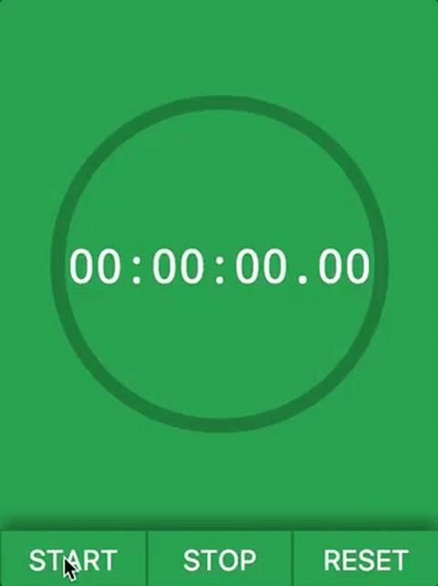

# Stopwatch in a closure

Stopwatch business logic in a single function

Live version: https://piotrberebecki.github.io/stopwatch-in-closure/



## Tech stack
* Browsersync
* Vanilla JavaScript
* ES6
* Flexbox

## Getting started

```sh
git clone `REPO URL HERE`
cd 'REPO NAME HERE'
npm install

#1. Start the development server with Browsersync reloading
npm start

#2. Open this url in your browser: http://localhost:3000
```
